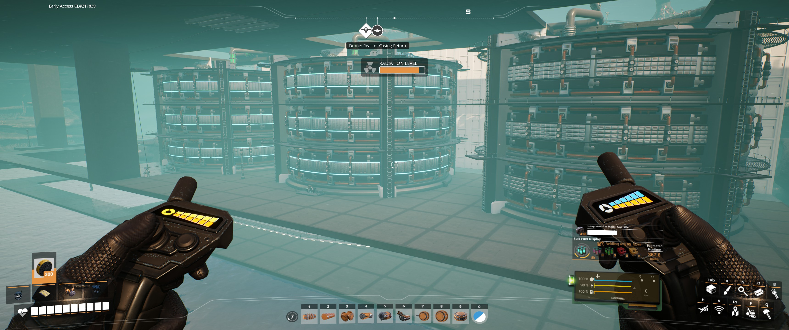

# Steam Pressure Relief Automation
This is a collection of documents and the lua code used to automate the handling of excess steam production in modular reactors[^1] for Satisfactory.
The goal of this project was to enable me to go work on my other factories with less down time on the reactors due to over-producing steam (which triggers an auto-shutdown event).

It is my hope / goal that this will help provide others interested or already experimenting with modular reactors and compressed steam another source for starting / improving their own setup.

If you have any questions / comments please let me know.

## How to use this repo / the code in your own factory
For just a basic checklist follow the steps below, for more instructions i'm planning on making a wiki to go into more detail.
- [ ] Build your factory for the Reactor Coolant and Advanced Reactor Core production
- [ ] Build your reactors
- [ ] Build the turbines and generators
- [ ] Build the computer network
- [ ] Copy / Paste in the lua code & run it
## Factory Layout
Here is a basic diagram of the layout of the factory (minus the portion to create the coolant and reactor cores).
Yellow is the Ficsit Networks Network Cable, Blue is Compressed Steam.

## To-Do List
- [ ] Refactor the Lua code
  - Need to make it cleaner and easier to read
- [ ] Add a timer function for opening and closing the valve (so it will close after 'x' seconds)

## Ideas for the future
### Monitoring the steam
I'm considering changing the way I monitor the steam production and amounts. I started this way because I adapted a version of this from what I had previously setup with the Circuitry mod (formly called Wiremod).[^2] That version would simply flush the small fluid buffers immediately "downstream" of the reactors so the reactor outputs wouldn't get backed up. While this worked I wanted to still use the steam that was produced.

### Misc.
- add graphs and charts on data screens
  - production line graphs (steam, power, etc.)
- add to / improve on the control panel
- add networking components for remote monitoring at another location
- create a shareable blueprint to put on [Satisfactory Calculator](https://satisfactory-calculator.com/)
- eventually add structure / design to the factory so it doesn't just float above the lake

## Mod List
- [Ficsit Mod Loader](https://ficsit.app/sml-versions)
  - uhh cuz...
- [Refined Power](https://ficsit.app/mod/RefinedPower)
  - Modular Reactors and necessary buildings / resources come from this mod.
- [Ficsit Networks](https://ficsit.app/mod/FicsItNetworks)
  - The computer that runs the Lua code and all associated components to connect your factory are from this mod.
- I use plenty of others but those are the required mods for this project.

## Screenshots

__Factory__

__Computer & Screens__

__Reactors__

__Generators__

__Steam Buffers & Valves__

__Control Panel__

__Control Panel Ready for manually flushing the buffers__

__Control Panel after flushing the buffers__

This looks similar to the previous but the LED displays in the bottom left show a smaller number (one each for a buffer's content/amount of steam).

[^1]: [Refined Power Mod](https://ficsit.app/mod/RefinedPower)
[^2]: [Circuitry Mod](https://ficsit.app/mod/FicsitWiremod)